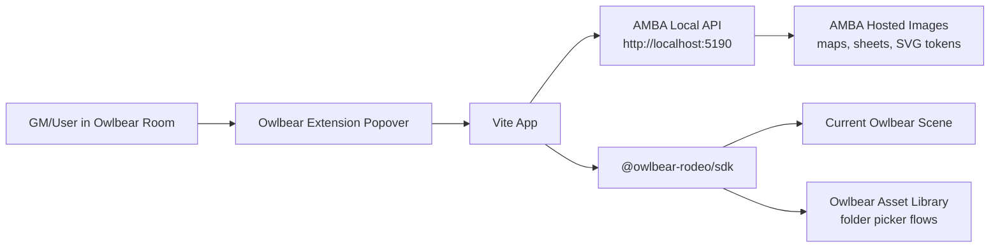
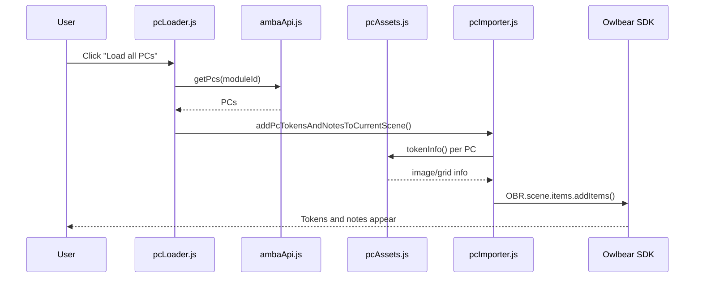
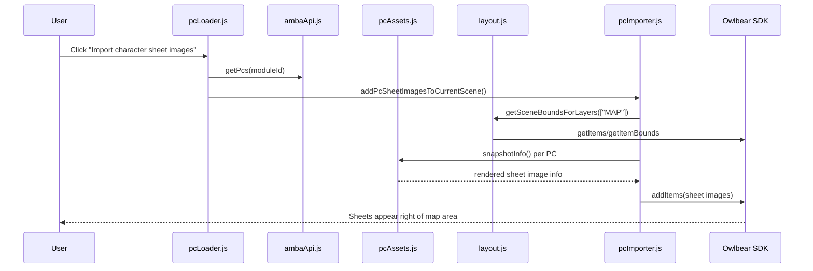
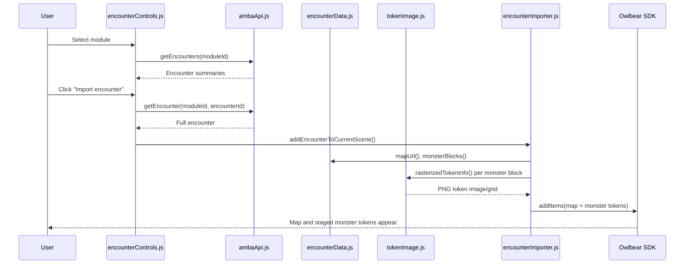

# AMBA Owlbear Extension Architecture

Last reviewed: 2026-08-15

This document explains the architecture of the AMBA Owlbear extension, the role of each module, the current import flows, and the practical boundaries of what this extension can and cannot do inside modern Owlbear Rodeo.

## External Context

Owlbear Rodeo 1.0 and the current Owlbear Rodeo platform have different integration stories.

Owlbear Rodeo 1.0, now published as `owlbear-rodeo-legacy`, has source code available for personal, non-commercial, private use. Its README describes it as the source for the original 1.0 application and includes instructions for local/Docker hosting. It also says the legacy code is not maintained or supported because Owlbear moved to the newer platform.

Modern Owlbear Rodeo is not integrated by replacing or self-hosting the core application in this repo. As far as we can verify, the Owlbear Rodeo 2.x application source is not publicly available for self-hosting or modification. The current documented integration path is an Owlbear extension: a separately hosted web app with a `manifest.json` that Owlbear loads into its UI, usually as an iframe popover, tool, context menu, background page, or related extension surface.

So the correction is slightly nuanced:

- Correct: for modern Owlbear Rodeo 2.x, the supported/practical way for AMBA to integrate is an extension.
- Also correct: Owlbear Rodeo 1.0 legacy can be self-hosted under its legacy terms.
- Not currently known or documented: a public source/self-hosting path for replacing or modifying the modern Owlbear Rodeo 2.x core.

Reviewed sources:

- Owlbear extension getting started: https://docs.owlbear.rodeo/extensions/getting-started/
- Owlbear manifest reference: https://docs.owlbear.rodeo/extensions/reference/manifest/
- Owlbear scene items API: https://docs.owlbear.rodeo/extensions/apis/scene/items/
- Owlbear assets API: https://docs.owlbear.rodeo/extensions/apis/assets/
- Owlbear scenes guide: https://docs.owlbear.rodeo/docs/scenes/
- Owlbear Rodeo 1.0 legacy source: https://github.com/owlbear-rodeo/owlbear-rodeo-legacy

## High-Level Architecture

The extension is a Vite browser application embedded into Owlbear Rodeo as an extension action popover. It talks to two external systems:

1. Owlbear Rodeo through `@owlbear-rodeo/sdk`.
2. AMBA through local HTTP API endpoints rooted at `http://localhost:5190`.

The extension does not run inside the AMBA server and does not run inside Owlbear's backend. It is browser JavaScript loaded into an Owlbear-managed iframe. That means all import behavior is constrained by:

- Owlbear SDK capabilities.
- Browser fetch/CORS behavior.
- AMBA endpoints that expose modules, PCs, encounters, maps, sheets, and token images.
- Image URL length and format limits accepted by Owlbear scene items.



## Map, Grid, Token, And Scene Strategy

AMBA can and should push maps, tokens, and encounter scenes, but the important design detail is that map scale and creature token scale are not the same concept.

### Map Scale

AMBA encounter maps are authored as:

```text
1 square = 5 ft
```

That lines up with the common tactical grid model used by D&D and Pathfinder. In Owlbear, the scene grid should therefore use:

```text
gridScale("5 ft")
gridType("SQUARE")
```

The image itself still needs resize/grid math so Owlbear knows how many image pixels correspond to one grid square. Owlbear image builders represent that through image-grid `dpi`, which is effectively "image pixels per scene grid cell" for our purposes.

If AMBA knows the map dimensions in squares:

```text
mapPixelWidth = rendered map image width in pixels
mapPixelHeight = rendered map image height in pixels
mapSquaresWide = AMBA map width in 5 ft squares
mapSquaresHigh = AMBA map height in 5 ft squares

dpiX = mapPixelWidth / mapSquaresWide
dpiY = mapPixelHeight / mapSquaresHigh
dpi = dpiX, assuming square pixels and consistent map export
```

The importer should validate that `dpiX` and `dpiY` are close. If they differ meaningfully, the map export metadata or raster size is inconsistent and the user should see a warning.

For SVG maps authored in square units, AMBA should rasterize them at a chosen target pixels-per-square value before sending to Owlbear. For example:

```text
targetPixelsPerSquare = 140
rasterWidth = mapSquaresWide * targetPixelsPerSquare
rasterHeight = mapSquaresHigh * targetPixelsPerSquare
dpi = targetPixelsPerSquare
```

This keeps the math straightforward: every AMBA square becomes one Owlbear grid cell, and Owlbear's grid scale labels each cell as 5 ft.

### Creature Token Scale

Rules check:

- Pathfinder 2e: Small and Medium creatures occupy 5 feet, Large creatures occupy 10 feet, Huge creatures occupy 15 feet, and Gargantuan creatures occupy 20 feet or more.
- D&D 5e/2024 follows the same broad grid pattern: Small and Medium are 5 ft by 5 ft, Large is 10 ft by 10 ft, Huge is 15 ft by 15 ft, and Gargantuan is 20 ft by 20 ft or larger.

That means a Medium humanoid occupying a 5 ft square is rules-correct. The subtle issue is visual interpretation: the 5 ft square is the creature's combat space, not literal shoulder width. A Medium humanoid token should occupy one grid square, but the drawn humanoid inside the token art should usually have visual padding.

Recommended token sizing:

```text
Tiny       = 0.5 square, or 1 square with a small visual marker if we want simpler UX
Small      = 1 square
Medium     = 1 square
Large      = 2 squares
Huge       = 3 squares
Gargantuan = 4+ squares
```

For a 512x512 token image:

```text
spaceSquares = creature space in grid squares
dpi = imagePixelWidth / spaceSquares
```

Examples:

```text
Medium 512px token, 1 square: dpi = 512 / 1 = 512
Large 512px token, 2 squares: dpi = 512 / 2 = 256
Huge 512px token, 3 squares: dpi = 512 / 3 = 170.666...
```

Alternatively, AMBA can rasterize larger tokens at a constant 512 pixels per square:

```text
Medium = 512x512, dpi 512
Large = 1024x1024, dpi 512
Huge = 1536x1536, dpi 512
```

The second approach preserves token art detail better for larger creatures. The first approach keeps file sizes smaller. For AMBA-generated tokens, the second approach is cleaner if image size is not a concern.

Important conclusion:

Rendering SVG token art as `1x1` is fine for a Medium creature if `1x1` means "one occupied grid square." It is not fine if the humanoid drawing fills the full SVG edge-to-edge and visually reads as a 5 ft wide body. The token canvas should be one square; the creature art should be padded inside that square.

### Ideal Encounter Flow

The ideal AMBA-to-Owlbear encounter flow is queue-driven:

1. User right-clicks an AMBA encounter.
2. User chooses "Export to Owlbear".
3. AMBA pushes the encounter ID into an Owlbear export queue.
4. The Owlbear extension reads the queue.
5. For each queued encounter, the extension pulls full encounter data from AMBA.
6. If the encounter has a map, the extension imports the map.
7. If the encounter has monster blocks, the extension loops through them, renders/rasterizes SVG tokens, and stages them in the scene.
8. The extension marks the queue item complete or failed in AMBA.

The minimum useful export is either:

- a map,
- monster blocks,
- or both.

If an encounter has both a map and monster blocks, both should be pushed in one queue item.

The current extension-side queue contract is:

```text
GET  /api/owlbear/export-queue
POST /api/owlbear/export-queue/:queueItemId/complete
POST /api/owlbear/export-queue/:queueItemId/fail
```

Queue items should include:

```json
{
  "id": "queue-item-id",
  "moduleId": "amba-module-id",
  "encounterId": "amba-encounter-id"
}
```

They may optionally embed enough encounter data for immediate import:

```json
{
  "id": "queue-item-id",
  "moduleId": "amba-module-id",
  "encounter": {
    "id": "amba-encounter-id",
    "title": "Encounter Name",
    "map": {},
    "monsterBlocks": []
  }
}
```

Embedded encounter data is useful for reducing one HTTP round trip, but the extension can fetch by `moduleId + encounterId` when needed.

The ideal longer-term Owlbear artifact is a new scene:

1. The scene is named after the AMBA encounter.
2. The AMBA map becomes the scene base map.
3. Scene grid is square with scale `5 ft`.
4. Monster-block tokens are added as default scene items.
5. PC tokens are added as default scene items, likely in a staging row/column outside the map.
6. User opens the scene and drags monster/PC tokens into final positions as needed.

The Owlbear SDK supports the pieces needed for this shape:

- `buildSceneUpload().name(...)`
- `buildSceneUpload().gridType("SQUARE")`
- `buildSceneUpload().gridScale("5 ft")`
- `buildSceneUpload().baseMap(imageUpload)`
- `buildSceneUpload().items(items)`
- `OBR.assets.uploadScenes(...)`

The tradeoff is that `uploadScenes` opens Owlbear's folder picker. That is acceptable for a "create a reusable scene in Owlbear" workflow, but it is less immediate than dropping items directly into the currently open scene.

The current minimum implementation uses direct scene insertion instead of creating a saved scene. It places any new map to the right of existing `MAP` and `CHARACTER` bounds, then stages monster tokens below the combined occupied area and new map so repeated queue imports do not stack on top of the same map or token pile.

### Scene Creation Vs Room Rebuild

There are two viable production flows.

Preferred flow:

1. Use Owlbear scene upload APIs.
2. Create a new scene named after the AMBA encounter.
3. Use the encounter map as the scene base map.
4. Include monster tokens and optional PC staging tokens as scene items.
5. Let Owlbear save the scene through its asset/library flow.

Fallback flow:

1. Use the currently open Owlbear room/scene as a rebuild canvas.
2. Clear existing content.
3. Rebuild the room from the AMBA encounter map and monster blocks.
4. Let the GM manually save the rebuilt room as a new Owlbear scene.

The fallback is useful if:

- scene upload is too clunky because of Owlbear's picker flow,
- we cannot access the desired saved-scene workflow directly,
- the GM wants a fast "make this room match AMBA now" button,
- or we need to test encounter export without committing to Owlbear asset-library behavior.

The SDK exposes the needed item APIs:

```text
OBR.scene.items.getItems(...)
OBR.scene.items.deleteItems(ids)
OBR.scene.items.addItems(items)
```

Recommended safety levels:

1. Clear AMBA-owned items only.
   - Find items with AMBA metadata namespace.
   - Delete only those item IDs.
   - Reimport the queued encounter.
   - This is safest for routine reimports.

2. Clear all scene items.
   - Delete every item returned by `OBR.scene.items.getItems()`.
   - Reimport the queued encounter.
   - This should require an explicit GM action such as `Clear room and rebuild`.
   - This is destructive to hand-placed props, notes, drawings, fog-related helper items, and non-AMBA content.

3. Add without clearing.
   - Current minimum behavior.
   - Places new content outside existing bounds.
   - Best for non-destructive testing.
   - Can clutter the room after repeated imports.

Recommended UI:

```text
Import queued exports
Reimport AMBA-owned items
Clear room and rebuild from queue
```

The screenshot-based current working model is GM-driven: the GM has the authoritative room view, AMBA can stage PCs/enemies in the Owlbear scene, and the GM can save the resulting room/scene once it looks right.

### PC Token Reuse And Asset Manager Limits

It is wasteful to push the same PC token into every encounter if the goal is long-term Owlbear asset management. In normal Owlbear usage, PC tokens belong in the Asset Manager under Characters and are reused by dragging them into scenes.

The current SDK supports uploading images with a type hint such as `"CHARACTER"`, and this extension already has a PC token upload path. However, the documented API says `uploadImages` opens a folder picker. The public SDK path does not appear to expose a silent "upload to this exact Characters folder" or "find/reuse this existing Character asset by metadata" workflow.

Practical options:

1. Direct scene items with AMBA-hosted token URLs.
   - Fast.
   - No Asset Manager duplication.
   - Depends on AMBA URLs remaining available.

2. Upload PC token images to Owlbear Characters through `OBR.assets.uploadImages`.
   - Better for Owlbear-native reuse.
   - Requires user folder picker.
   - No known silent folder target or de-duplication API.

3. Include PC token items in every generated encounter scene.
   - Best one-click encounter setup.
   - Potentially duplicates items/scenes.
   - Not the same as reusable Character assets.

Recommended near-term approach:

- For encounter scene generation, include PC tokens as scene items using durable AMBA-hosted token URLs or AMBA-hosted raster PNG URLs.
- Add a separate "Upload PCs to Owlbear Characters" button for users who want native asset-library reuse.
- Do not block encounter creation on PC asset-library upload.

Recommended longer-term approach:

- Make AMBA expose stable raster PNG token URLs for PCs and monsters.
- Store AMBA metadata on all scene items.
- Add duplicate detection for AMBA-owned scene items.
- If Owlbear later exposes asset lookup or targeted folder APIs, add true PC Character asset reuse.

## Runtime Entry Points

### `index.html`

The HTML shell loaded by Vite. It provides the root `#app` element that the JavaScript app fills.

### `src/main.js`

Application JavaScript entry point. It imports global styles and calls `startApp()`.

Responsibilities:

- Load `src/style.css`.
- Start the extension application.

### `src/app/startApp.js`

Bootstraps the extension after Owlbear is ready.

Responsibilities:

- Render the extension UI shell.
- Wait for `OBR.onReady()`.
- Show connection status.
- Wire the room test button.
- Wire AMBA module, PC, sheet, and encounter controls.

Important behavior:

- The UI is rendered before `OBR.onReady()` so the user gets immediate visible feedback.
- Owlbear-dependent controls are wired only after Owlbear reports readiness.

## Manifest And Owlbear Loading

### `public/manifest.json`

Defines the Owlbear extension metadata and action popover.

Current action:

- Title: `AMBA`
- Icon: `/favicon.svg`
- Popover: `/`
- Size: `400 x 500`

This means Owlbear loads the Vite app root as a popover iframe from the extension action. The manifest does not currently define background scripts, custom tools, context menus, or extra iframe permissions.

## UI Modules

### `src/ui/renderAppShell.js`

Builds the static DOM for the extension popover.

Current panels:

- Prototype room test.
- AMBA PCs.
- AMBA Encounters.

This module intentionally does not contain business logic. It only defines controls and status elements:

- `#testRoom`
- `#modulePicker`
- `#loadPcs`
- `#importSheetImages`
- `#pcList`
- `#importStatus`
- `#encounterPicker`
- `#importEncounter`
- `#encounterStatus`

### `src/style.css`

Small global stylesheet for the popover.

Current style scope:

- Basic typography.
- Shell padding.
- Panel borders and spacing.
- Button/select styling.
- Error text color.

The UI is intentionally utilitarian because the extension is a working import/control panel, not a landing page.

### `src/amba/pcLoader.js`

Wires the AMBA PC panel and module picker.

Responsibilities:

- Load `{current-user}` modules from AMBA.
- Populate the module picker.
- Default to the first module with PCs.
- Handle "Load all PCs".
- Handle "Import character sheet images".
- Delegate encounter controls to `wireEncounterControls()`.

This module now acts as orchestration glue. Rendering helpers live in `uiHelpers.js`; encounter-specific UI behavior lives in `encounterControls.js`; Owlbear item construction lives under `src/owlbear/`.

### `src/amba/encounterControls.js`

Owns the encounter picker and encounter import button.

Responsibilities:

- Fetch encounter summaries for the selected module.
- Populate `#encounterPicker`.
- Preserve a stable fallback key for encounter summaries that may not have IDs.
- Fetch a full encounter when an ID/slug is available.
- Fall back to the selected summary when a full encounter endpoint cannot be addressed by ID.
- Call `addEncounterToCurrentScene()`.
- Report import results to `#encounterStatus`.

Important design choice:

Encounter data shape is still treated as flexible. This module does not assume every summary has a durable `id`; it can key by `id`, `encounterId`, `slug`, or list index.

### `src/amba/uiHelpers.js`

Small DOM and error helpers shared by AMBA UI control modules.

Exports:

- `errorMessage(error, fallback)`
- `renderPcButtons(container, pcs)`
- `encounterLabel(encounter)`
- `encounterKey(encounter, index)`

This keeps the main UI control modules from accumulating repetitive browser/UI utility code.

## AMBA API Module

### `src/amba/ambaApi.js`

Centralizes all AMBA HTTP calls and URL builders.

Base URL:

```js
const AMBA_BASE_URL = "http://localhost:5190";
```

Current JSON endpoints:

- `getModules()`
  - `GET /api/modules`
  - Authenticated `{current-user}` module picker source.

- `getPcs(moduleId)`
  - `GET /api/modules/:moduleId/pcs`
  - Used by token/note and sheet imports.

- `getEncounters(moduleId)`
  - `GET /api/modules/:moduleId/encounters`
  - Used to populate encounter picker.

- `getEncounter(moduleId, encounterId)`
  - `GET /api/modules/:moduleId/encounters/:encounterId`
  - Used to fetch one full encounter.

Current image URL builders:

- `getPcSheetImageUrl(moduleId, pcId, color)`
  - Returns a short AMBA URL for rendered character sheet PNG.

- `getPcTokenImageUrl(moduleId, pcId, color)`
  - Returns a short AMBA URL for generated PC token SVG.

- `getMonsterTokenImageUrl(moduleId, monsterId, color)`
  - Returns a best-effort conventional AMBA URL for generated NPC/monster token SVG.
  - Encounter payloads can override this with explicit token/image URLs.

- `getPcNoteImageUrl(moduleId, pcId, color)`
  - Retained for older image-backed note experiments.

- `toAmbaUrl(path)`
  - Converts relative AMBA asset paths to absolute URLs.

- `getModuleUrl(moduleId)`
  - Convenience URL for opening AMBA module UI.

Important constraint:

The extension avoids base64/data URLs for Owlbear scene items because Owlbear validation rejects overly long image URLs. Short AMBA-hosted URLs are preferred.

## Owlbear Service Modules

### `src/owlbear/sceneService.js`

Small notification/readiness wrapper.

Exports:

- `isSceneReady()`
- `show(message)`

Used by the prototype room test.

### `src/owlbear/roomTest.js`

Wires the "Test Room Access" button.

Behavior:

- If no scene is open, shows `No active scene.`
- If a scene is ready, shows `AMBA can access this scene.`

This remains a useful smoke test for Owlbear SDK connectivity.

### `src/owlbear/sceneItems.js`

Shared current-scene insertion helper.

Exports:

- `addItemsToCurrentScene(items)`

Behavior:

- Verifies `OBR.scene.isReady()`.
- Throws a readable error if no scene is open.
- Calls `OBR.scene.items.addItems(items)`.

This is the no-folder-picker path. Unlike asset uploads, direct scene insertion does not ask the user to pick an Owlbear library folder.

### `src/owlbear/layout.js`

Shared layout and metadata helpers.

Exports:

- `NS`
  - Metadata namespace: `com.adventuremakerbyact.owlbear`

- `boundsFromImageInfo(imageInfo, position)`
  - Computes bounds for newly built image items.

- `boundsFromItems(items)`
  - Position-only fallback bounds calculator.

- `getSceneBoundsForLayers(layers)`
  - Fetches current scene items matching layers.
  - Attempts `OBR.scene.items.getItemBounds()`.
  - Falls back to position bounds if Owlbear bounds lookup fails.

- `gridPosition(index, options)`
  - Generic grid/staging layout function.

- `rightOfBounds(bounds, margin)`
  - Finds an origin to the right of existing bounds.

- `belowBounds(bounds, margin)`
  - Finds an origin below existing bounds.

Current layout strategy:

- Encounter maps go near `{ x: 600, y: 600 }`.
- Encounter monster tokens are dumped below the map or below existing map-layer bounds.
- Character sheet snapshots are docked to the right of map-layer bounds.

The layout deliberately does not do tactical placement yet. The current goal is "dump them and let the user drag."

## Image And Token Modules

### `src/owlbear/imageUtils.js`

Shared browser image helpers.

Exports:

- `safeName(value, fallback)`
- `fetchImageBlob(url, filename)`
- `imageSizeFromBlob(blob, name)`
- `imageInfoFromUrl(url, filename, fallbackType, dpi)`
- `rasterizeSvgFile(svgFile, filename, width, height)`

Important behavior:

- Images are fetched through browser `fetch`.
- Decoding uses `createImageBitmap` to determine dimensions.
- SVG rasterization uses an in-browser canvas and returns a PNG `File`.
- Empty images fail early with a specific filename.

Why rasterize SVG tokens?

Owlbear scene items can often reference short SVG URLs directly, but asset-library upload flows are more reliable with PNG files. Monster encounter tokens are currently rasterized before being placed so the token artwork path matches the requested "SVG rasterized token" behavior.

### `src/owlbear/tokenImage.js`

Focused helper for token image conversion.

Exports:

- `rasterizedTokenInfo(url, filename)`

Behavior:

- Fetches a token image.
- If it is SVG or looks like SVG by URL, rasterizes to a 512x512 PNG object URL.
- If it is already raster image data, keeps the original URL and decodes dimensions.
- Returns the `image` and `grid` objects expected by Owlbear `buildImage()`.

## PC Import Modules

### `src/owlbear/pcAssets.js`

Owns PC-specific AMBA asset resolution.

Exports:

- `TOKEN_COLOR`
- `NOTE_COLORS`
- `characterSheetHtml(pc)`
- `tokenInfo(moduleId, pc, color)`
- `generatedTokenUpload(moduleId, moduleTitle, pc, color)`
- `noteInfo(moduleId, pc)`
- `snapshotInfo(moduleId, pc)`

Responsibilities:

- Find a character sheet narrative.
- Find portrait art metadata or artifacts.
- Fall back to generated AMBA token SVGs.
- Build rendered character sheet PNG image info.
- Build generated PC token uploads for Owlbear's Character asset library.

Portrait resolution order:

1. `pc.metadata.characterArt[]`
2. `pc.metadata.portraitUrl`
3. Image artifacts with role `portrait` or `art`
4. Generated AMBA first-letter token

### `src/owlbear/pcImporter.js`

Builds PC-related Owlbear items and runs PC import flows.

Primary exports:

- `importPcAsScene({ moduleId, moduleTitle, pc })`
- `addPcToCurrentScene({ moduleId, pc })`
- `importPcsAsScene({ moduleId, moduleTitle, pcs })`
- `addPcsToCurrentScene({ moduleId, pcs })`
- `addPcTokensAndNotesToCurrentScene({ moduleId, pcs })`
- `addPcSheetImagesToCurrentScene({ moduleId, pcs })`
- `uploadPcTokensToCharacters({ moduleId, moduleTitle, pcs })`

Current primary PC flow:

`addPcTokensAndNotesToCurrentScene()`

- Fetches token art per PC.
- Builds one `CHARACTER` layer token.
- Builds one colored `NOTE` layer rectangle.
- Builds one editable text item on top of the rectangle.
- Adds all items directly to the current scene.

Character sheet image flow:

`addPcSheetImagesToCurrentScene()`

- Fetches rendered sheet PNGs.
- Skips PCs whose sheet render fails.
- Gets map-layer bounds from the current scene.
- Places sheets to the right of the map area with a margin.
- Adds only successful sheet image items.

Legacy/full sheet flows:

The file still preserves older prototype functions that build richer PC bundles:

- Token.
- Rich-text character sheet note.
- Rendered PNG sheet snapshot.

Those flows are useful for testing but are not the main "Load all PCs" path because missing sheets can cause failures.

## Encounter Import Modules

### `src/owlbear/encounterData.js`

Normalizes flexible AMBA encounter payloads.

Exports:

- `TOKEN_COLORS`
- `encounterTitle(encounter)`
- `encounterId(encounter)`
- `mapUrl(encounter)`
- `monsterBlocks(encounter)`
- `monsterName(block)`
- `monsterId(block)`
- `monsterCount(block)`
- `monsterTokenUrl(moduleId, block, color)`

Supported map fields:

- `encounter.map.url`
- `encounter.map.imageUrl`
- `encounter.map.src`
- `encounter.map.payload.url`
- `encounter.mapUrl`
- `encounter.mapImageUrl`
- `encounter.imageUrl`

Supported monster collection fields:

- `monsterBlocks`
- `monsters`
- `npcs`
- `creatures`

Supported monster token/image fields:

- `block.tokenUrl`
- `block.tokenSvgUrl`
- `block.imageUrl`
- `block.portraitUrl`
- `block.npc.*`
- `block.monster.*`
- fallback to `getMonsterTokenImageUrl(moduleId, monsterId, color)`

This module exists because AMBA encounter payloads are likely to evolve. Keeping payload normalization isolated prevents the Owlbear importer from becoming a pile of optional chaining.

### `src/owlbear/encounterImporter.js`

Builds encounter map and monster token items.

Export:

- `addEncounterToCurrentScene({ moduleId, encounter })`

Behavior:

1. Try to build a map item.
2. If present, place it on the `MAP` layer and lock it.
3. Compute bounds from the new map.
4. If no map is present, inspect existing map-layer bounds.
5. Build monster token items from encounter monster blocks.
6. Rasterize SVG monster tokens to PNG object URLs.
7. Place tokens in a staging grid below the map/map area.
8. Add all items directly to the current scene.

Current map import behavior:

- A map is one image item on the `MAP` layer.
- It is locked to avoid accidental movement.
- It is tagged with AMBA metadata.
- It does not create a new Owlbear Scene asset.
- It does not use Owlbear's Asset Manager folder picker.

Current monster behavior:

- One token is created per monster count.
- Tokens are placed on the `CHARACTER` layer.
- Tokens are named with copy numbers when count is greater than one.
- No tactical placement is attempted.
- Users drag tokens into place manually.

## Data Flow: PC Tokens And Notes



## Data Flow: Character Sheets



## Data Flow: Encounter Import



## Metadata Strategy

Every AMBA-owned item should use the namespace:

```text
com.adventuremakerbyact.owlbear
```

Typical metadata keys:

- `${NS}/moduleId`
- `${NS}/pcId`
- `${NS}/encounterId`
- `${NS}/monsterId`
- `${NS}/kind`

Known `kind` values:

- `pc-token`
- `pc-placeholder-note`
- `pc-placeholder-note-text`
- `character-sheet`
- `character-sheet-snapshot`
- `encounter-map`
- `monster-token`

Why metadata matters:

- Future cleanup tools can delete or update AMBA imports.
- Future context menus can detect AMBA-owned items.
- Re-import/de-duplication can be added later.
- AMBA can trace scene objects back to module, encounter, PC, or monster records.

## What Is Possible

The extension can:

- Load as an Owlbear extension action popover.
- Fetch AMBA module, PC, encounter, sheet, map, and token data if AMBA exposes it over HTTP with browser-compatible CORS.
- Add image, shape, and text items directly to the current Owlbear scene.
- Put items on Owlbear layers such as `MAP`, `CHARACTER`, and `NOTE`.
- Lock map items.
- Attach metadata to generated Owlbear items.
- Read current scene items.
- Ask Owlbear for item bounds.
- Use bounds to place sheets outside the map area.
- Rasterize SVG tokens in the browser using canvas.
- Upload image assets or scenes through Owlbear asset APIs when the user accepts Owlbear's folder picker.
- Create saved scene uploads with `buildSceneUpload()` if we choose a library-oriented flow later.
- Add future context menus, tools, popovers, and background pages using documented Owlbear extension surfaces.

Near-term possible improvements:

- Add de-duplication when importing the same encounter twice.
- Add a cleanup button for AMBA-owned items by metadata.
- Add a "reimport encounter" path that updates map/token items instead of adding duplicates.
- Add an encounter context menu or tool mode.
- Add configurable layout options: right, below, staging area size, token columns.
- Add map grid metadata if AMBA exposes grid cell size/offset.
- Add tactical monster placement if AMBA later stores coordinates.
- Add folder-library upload flows for maps/tokens if asset library persistence is more important than immediate scene insertion.

## What Is Not Possible Or Not Currently Supported

The extension cannot currently:

- Modify Owlbear Rodeo's server-side code or replace the Owlbear v2 application.
- Self-host modern Owlbear Rodeo from this repo.
- Bypass Owlbear's extension sandbox/iframe model.
- Write directly to Owlbear's private backend storage except through the SDK.
- Silently upload assets into an arbitrary Owlbear folder without Owlbear's picker where the SDK requires user choice.
- Guarantee asset persistence for object URLs used for rasterized scene tokens outside the life of the scene/session unless Owlbear stores the item image content as part of its normal scene item handling.
- Access AMBA data that is not exposed through browser-reachable endpoints.
- Fetch AMBA images if CORS or network access blocks them.
- Use long base64 image URLs reliably as Owlbear item image URLs.
- Automatically place monsters tactically on the map without placement metadata.
- Infer map grid alignment perfectly unless AMBA exposes grid dimensions/offsets or the user aligns it later.
- Guarantee that every PC has a character sheet image.
- Guarantee that every encounter has a map.
- Guarantee that every monster block has a token image unless AMBA provides explicit URLs or the conventional fallback endpoint exists.

Important nuance about object URLs:

Monster SVGs are rasterized to PNG object URLs before placement. This satisfies the current local browser representation and keeps item URLs short. If Owlbear does not persist object URL image contents in a way that survives reloads, a more durable approach should be added: upload rasterized PNGs to Owlbear assets or have AMBA serve rasterized PNG token URLs directly.

## Current Architectural Tradeoffs

### Direct Scene Insert Vs Asset Library Upload

The current encounter flow uses direct scene insertion:

- Faster.
- No Owlbear folder picker.
- Matches the user story: click encounter, dump map/tokens into the current room.

Asset uploads are still useful for:

- Persistent reusable maps/tokens.
- User-managed Owlbear libraries.
- Saved scene creation.

But asset APIs open Owlbear picker flows, so they are less direct for one-click encounter dumping.

### Flexible Payload Parsing

Encounter data is normalized defensively because AMBA encounter schemas are not fully encoded in this extension yet.

Pros:

- The extension can work with multiple likely payload shapes.
- AMBA server changes are less likely to break the importer immediately.

Cons:

- The contract is implicit.
- Errors may be less obvious than with strict validation.

Recommended future step:

Define a formal AMBA encounter export DTO and make `encounterData.js` validate against it.

### Sheets Docked By Map Bounds

Character sheets now inspect map-layer bounds and dock to the right.

Pros:

- Prevents obvious overlap with the encounter map in a shared room.
- Works even if the map was not imported by AMBA, as long as it is on Owlbear's `MAP` layer.

Cons:

- It does not consider non-map items.
- It does not search for empty space globally.
- Large multi-map scenes may still need manual cleanup.

Recommended future step:

Add a true layout planner that considers all AMBA-owned items and all map bounds, then chooses a staging region.

## Build And Verification

The current project is a small Vite app.

For Owlbear loading instructions, see [loading-extension.md](./loading-extension.md).

For the always-on Linux production hosting plan, see [linux-production-hosting.md](./linux-production-hosting.md).

For player join and token control testing, see [player-join-token-control-test.md](./player-join-token-control-test.md).

For AMBA-side Owlbear configuration and production queue behavior, see [amba-owlbear-configuration-flow.md](./amba-owlbear-configuration-flow.md).

For remembering Owlbear token positions in AMBA and future upsert imports, see [placement-sync-upsert-guide.md](./placement-sync-upsert-guide.md).

Common commands:

```bash
npm.cmd run build
npm.cmd run dev
```

Current verification used for recent changes:

```bash
npm.cmd run build
git diff --check
```

Manual test checklist:

1. Start AMBA locally on `http://localhost:5190`.
2. Start the extension dev server.
3. Install/load the manifest in Owlbear.
4. Open an Owlbear room with an active scene.
5. Click "Test Room Access".
6. Select a module.
7. Load all PCs.
8. Import character sheet images and confirm they appear outside the map area.
9. Select an encounter.
10. Import encounter.
11. Confirm map appears locked on `MAP`.
12. Confirm monster tokens appear on `CHARACTER` below the map area.
13. Drag monster tokens manually onto the map.

## Suggested Next Steps

1. Formalize the AMBA encounter export schema.
2. Make AMBA provide durable raster PNG token URLs, or upload rasterized PNGs through Owlbear assets when persistence matters.
3. Add cleanup/reimport tools keyed by AMBA metadata.
4. Add duplicate detection before imports.
5. Add map grid alignment data to encounter exports.
6. Add a layout planner for multi-map rooms and sheet docks.
7. Add user-facing settings for import mode:
   - direct scene dump,
   - upload to asset library,
   - create saved Owlbear scene.
8. Add tests around `encounterData.js` normalization and layout helpers.
