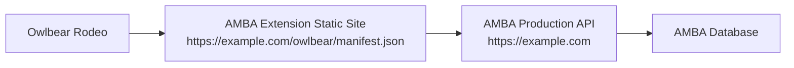

# Production Linux Hosting Plan

This document describes how to host the AMBA Owlbear extension on the production Linux box so Owlbear Rodeo can load it reliably 24/7.

## The Problem

During development, the extension is loaded from a local Vite dev server:

```text
http://localhost:5173/manifest.json
```

That works only while the dev machine is awake and `npm.cmd run dev` is running. If Owlbear Rodeo tries to load the extension later and that dev server is offline, Owlbear reports that the extension cannot be loaded.

For production, the extension URL must point to an always-on host.

## Key Production Decision

The Owlbear extension does not need a Node/Vite dev server running 24/7.

The better production model is:

1. Build the extension once with Vite.
2. Serve the generated static files from the Linux production box.
3. Point Owlbear Rodeo at the production `manifest.json`.
4. Keep AMBA's backend/API service running separately.

The extension is browser JavaScript. Once built, it is static HTML/CSS/JS plus assets. A normal web server can host it.

## Target Shape



Recommended production layout:

```text
/var/www/amba-owlbear-extension/current/
  index.html
  manifest.json
  favicon.svg
  icons.svg
  assets/
```

The production manifest URL would be something like:

```text
https://edmundo.com/owlbear/manifest.json
```

or:

```text
https://owlbear.edmundo.com/manifest.json
```

## Build Artifact

From the repo:

```bash
npm install
npm run build
```

Vite writes the static build to:

```text
dist/
```

That directory is what should be copied or deployed to the Linux box.

## Important: AMBA API Base URL

The current extension source uses:

```js
const AMBA_BASE_URL = "http://localhost:5190";
```

That is correct for local development, but not for production. In production, the extension running inside the user's browser must call a public or otherwise reachable AMBA URL.

Before production deployment, change this to a configurable build-time value, for example:

```js
const AMBA_BASE_URL = import.meta.env.VITE_AMBA_BASE_URL ?? "http://localhost:5190";
```

Then production can build with:

```bash
VITE_AMBA_BASE_URL=https://edmundo.com npm run build
```

Development can continue to use localhost:

```bash
VITE_AMBA_BASE_URL=http://localhost:5190 npm run dev
```

## HTTPS

Production should use HTTPS.

Owlbear Rodeo is loaded over HTTPS. Browser security rules can block or warn on insecure extension/API resources, especially when a secure page tries to load or fetch insecure HTTP resources.

Recommended:

- Serve the extension over HTTPS.
- Serve AMBA API endpoints over HTTPS.
- Use valid TLS certificates, usually through Let's Encrypt.

## Nginx Static Hosting Example

Example nginx site config:

```nginx
server {
    listen 443 ssl http2;
    server_name owlbear.edmundo.com;

    root /var/www/amba-owlbear-extension/current;
    index index.html;

    location / {
        try_files $uri $uri/ /index.html;
    }

    location = /manifest.json {
        add_header Cache-Control "no-cache";
        try_files $uri =404;
    }

    location /assets/ {
        add_header Cache-Control "public, max-age=31536000, immutable";
        try_files $uri =404;
    }
}
```

Notes:

- `manifest.json` should not be aggressively cached while the extension is changing.
- Hashed Vite assets under `/assets/` can be cached long-term.
- If hosting under a subpath like `/owlbear/`, Vite `base` may need to be configured.

## Subdomain Vs Subpath

### Subdomain

Example:

```text
https://owlbear.edmundo.com/manifest.json
```

This is the simplest deployment shape because Vite paths can stay rooted at `/`.

### Subpath

Example:

```text
https://edmundo.com/owlbear/manifest.json
```

This can work, but Vite should be built with the correct base path:

```js
export default defineConfig({
  base: "/owlbear/",
});
```

The current `vite.config.js` does not set a production base. A subdomain is therefore the lower-friction first production target.

## AMBA Backend Service

The AMBA API should run as its own long-lived Linux service, separate from the extension static files.

The extension expects AMBA endpoints such as:

```text
GET  /api/dev/test-user/modules
GET  /api/modules/:moduleId/pcs
GET  /api/modules/:moduleId/encounters
GET  /api/modules/:moduleId/encounters/:encounterId
GET  /api/owlbear/export-queue
POST /api/owlbear/export-queue/:queueItemId/complete
POST /api/owlbear/export-queue/:queueItemId/fail
```

For production, the dev-only module endpoint should eventually be replaced with authenticated user/module context.

## Systemd For AMBA API

The extension static files do not need systemd. The AMBA API does.

Example systemd unit shape:

```ini
[Unit]
Description=AMBA web application
After=network.target

[Service]
WorkingDirectory=/opt/amba/current
ExecStart=/usr/bin/dotnet /opt/amba/current/AMBA.dll
Restart=always
RestartSec=5
Environment=ASPNETCORE_ENVIRONMENT=Production
Environment=ASPNETCORE_URLS=http://127.0.0.1:5190

[Install]
WantedBy=multi-user.target
```

Nginx can then reverse proxy public HTTPS traffic to the local AMBA service.

## CORS

The AMBA API must allow requests from the production extension origin.

Example allowed origins:

```text
https://owlbear.edmundo.com
https://www.owlbear.rodeo
https://owlbear.rodeo
```

The exact AMBA CORS policy depends on whether the API and extension share a domain.

If the extension is hosted at:

```text
https://owlbear.edmundo.com
```

and AMBA API is at:

```text
https://edmundo.com
```

then AMBA must allow cross-origin browser requests from `https://owlbear.edmundo.com`.

## Deployment Steps

1. Update the extension to use `VITE_AMBA_BASE_URL`.
2. Choose production extension URL:

   ```text
   https://owlbear.edmundo.com/manifest.json
   ```

3. Build:

   ```bash
   VITE_AMBA_BASE_URL=https://edmundo.com npm run build
   ```

4. Copy `dist/` to the Linux box:

   ```bash
   /var/www/amba-owlbear-extension/releases/<timestamp>/
   ```

5. Update the `current` symlink:

   ```bash
   ln -sfn /var/www/amba-owlbear-extension/releases/<timestamp> /var/www/amba-owlbear-extension/current
   ```

6. Reload nginx:

   ```bash
   sudo nginx -t
   sudo systemctl reload nginx
   ```

7. Open the manifest URL in a browser and confirm JSON loads.
8. Add or update the custom extension URL in Owlbear Rodeo.
9. Open an Owlbear room and confirm the AMBA extension popover loads.
10. Click `Test Room Access`.
11. Test queued encounter export from AMBA.

## Rollback

Keep timestamped releases:

```text
/var/www/amba-owlbear-extension/releases/2026-08-15-120000
/var/www/amba-owlbear-extension/releases/2026-08-15-130000
/var/www/amba-owlbear-extension/current -> /var/www/amba-owlbear-extension/releases/2026-08-15-130000
```

Rollback is just changing the symlink:

```bash
ln -sfn /var/www/amba-owlbear-extension/releases/<previous> /var/www/amba-owlbear-extension/current
sudo systemctl reload nginx
```

## Monitoring

Minimum checks:

- The extension manifest URL returns `200`.
- The extension `index.html` returns `200`.
- AMBA API health endpoint returns `200`.
- AMBA export queue endpoint returns valid JSON for an authenticated/allowed request.

Example:

```bash
curl -I https://owlbear.edmundo.com/manifest.json
curl -I https://owlbear.edmundo.com/
curl -I https://edmundo.com/health
```

## Production TODOs

1. Make `AMBA_BASE_URL` environment-based.
2. Decide subdomain vs subpath.
3. Add production nginx config.
4. Add deploy script or CI job that builds and publishes `dist/`.
5. Add AMBA API health endpoint if one does not already exist.
6. Add CORS entries for the production extension origin.
7. Replace dev test-user module loading with authenticated production context.
8. Confirm Owlbear custom extension accepts and loads the production manifest URL.

For the production current-module and queue UX, see [amba-owlbear-configuration-flow.md](./amba-owlbear-configuration-flow.md).
